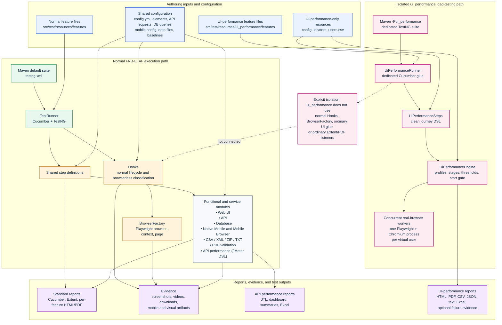
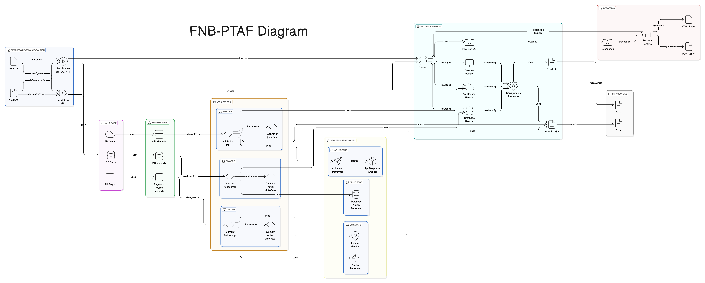

# FNB-ETAF Framework Guide and Workspace Update

**Document date:** 23 September 2026
**Framework:** FNB-ETAF
**Scope:** Current Dev-based workspace implementation and its versioned and uncommitted repository contents

## Purpose

FNB-ETAF is a Java 21 Maven test automation framework built around Cucumber, TestNG or JUnit entry points, Playwright, Appium, JDBC, PDFBox, and JMeter DSL. It organizes functional, service, data, document, mobile, and performance testing in one repository while keeping the **`ui_performance`** browser-load path deliberately separate from normal UI automation.

This guide is the top-level map for locating code, resources, execution entry points, outputs, and module documentation. It records only behavior that is visible in the current workspace. It does not authorize targets, supply credentials, or imply that every alternate runner is part of the default Maven suite.

> **Critical boundary:** `ui_performance` is an **isolated concurrent-browser load-testing path**. It uses a dedicated Maven profile, TestNG suite, runner, resource set, and engine. It does **not** use regular UI `Hooks`, normal `BrowserFactory`, normal UI step definitions, or ordinary Extent/PDF listeners.

## Architecture at a glance

The editable source is [`architecture/fnb-etaf-framework-architecture.mmd`](../../Downloads/FNB-ETAF_Framework_Documentation/docs/architecture/fnb-etaf-framework-architecture.mmd). A rendered overview is available below and as [a PNG image](../../Downloads/FNB-ETAF_Framework_Documentation/docs/architecture/fnb-etaf-framework-architecture.png). The same Mermaid source is embedded after the image so the structure remains editable and reviewable in source control.




### Detailed FNB-ETAF class and module architecture

The original FNB-PTAF layer model has been updated and renamed to **FNB-ETAF**. The detailed architecture preserves the original progression from specification and execution through glue code, business methods, core actions, services, data, and reporting. It also adds the current native-mobile, mobile-browser, CSV/XML/TXT/ZIP, PDF, API-performance, `ui_performance`, evidence, video, download, per-feature report, and performance-report components.

The diagram is available as an [editable D2 source](../../Downloads/FNB-ETAF_Framework_Documentation/docs/architecture/fnb-etaf-detailed-architecture.d2), [scalable SVG](../../Downloads/FNB-ETAF_Framework_Documentation/docs/architecture/fnb-etaf-detailed-architecture.svg), [high-resolution PNG](../../Downloads/FNB-ETAF_Framework_Documentation/docs/architecture/fnb-etaf-detailed-architecture.png), and [shareable vector PDF](../../Downloads/FNB-ETAF_Framework_Documentation/docs/architecture/fnb-etaf-detailed-architecture.pdf). Use the SVG or PDF when zooming into class names and relationship labels.

[](../../Downloads/FNB-ETAF_Framework_Documentation/docs/architecture/fnb-etaf-detailed-architecture.svg)

## Repository anatomy and source map

The codebase separates reusable framework implementation under `src/main/java` from runners, step definitions, and test resources under `src/test`. The table is an operational starting point: each location is linked from `docs/` and can be used to trace an observed test behavior back to the responsible layer.

| Architecture concern | Primary source and resource locations | Responsibility and navigation guidance |
|---|---|---|
| Build and dependency control | [`../pom.xml`](../pom.xml) | Declares Java 21 source and target, Cucumber, TestNG, Playwright, Appium, JDBC, PDFBox, JMeter DSL, Surefire, and the `ui_performance` Maven profile. Start here for dependency or suite-selection questions. |
| Default Maven suite | [`../src/test/resources/testng.xml`](../src/test/resources/testng.xml) and [`../src/test/java/com/ptaf/runner/TestRunner.java`](../src/test/java/com/ptaf/runner/TestRunner.java) | The default Surefire suite starts this TestNG/Cucumber runner. The runner scans `src/test/resources/features`, shared step definitions, and hooks. Its current tag expression is `@eStore`. |
| Shared test lifecycle | [`../src/main/java/com/ptaf/hooks/Hooks.java`](../src/main/java/com/ptaf/hooks/Hooks.java), [`../src/main/java/com/ptaf/hooks/MobileHooks.java`](../src/main/java/com/ptaf/hooks/MobileHooks.java), and [`../src/main/java/com/ptaf/hooks/DatabaseHooks.java`](../src/main/java/com/ptaf/hooks/DatabaseHooks.java) | `Hooks` manages normal Playwright setup and cleanup and detects classes of browserless scenarios. Mobile and database lifecycles have dedicated hooks. |
| Shared configuration | [`../src/main/java/com/ptaf/utils/ConfigurationProperties.java`](../src/main/java/com/ptaf/utils/ConfigurationProperties.java), [`../src/main/java/com/ptaf/utils/YamlReader.java`](../src/main/java/com/ptaf/utils/YamlReader.java), and [`../src/test/resources/config/config.yml`](../src/test/resources/config/config.yml) | Resolves global configuration with optional `environments.<env>.*` overrides; `env` defaults to `QA`. Keep secret values outside committed YAML. |
| Regular web UI | [`../src/main/java/com/ptaf/ui/`](../src/main/java/com/ptaf/ui/), [`../src/main/java/com/ptaf/utils/BrowserFactory.java`](../src/main/java/com/ptaf/utils/BrowserFactory.java), [`../src/test/java/com/ptaf/stepdefinitions/`](../src/test/java/com/ptaf/stepdefinitions/), [`../src/test/resources/elements/`](../src/test/resources/elements/), and [`../src/test/resources/features/`](../src/test/resources/features/) | Normal Playwright browser automation. Trace from a feature to shared step definitions, then UI pages/actions/handlers and locator YAML. |
| API automation | [`../src/main/java/com/ptaf/api/`](../src/main/java/com/ptaf/api/), [`../src/test/java/com/ptaf/stepdefinitions/ApiSteps.java`](../src/test/java/com/ptaf/stepdefinitions/ApiSteps.java), and [`../src/test/resources/api_requests/api_requests.yml`](../src/test/resources/api_requests/api_requests.yml) | YAML-driven HTTP request definitions and response behavior. API scenarios are classified as browserless by the shared lifecycle. |
| Database automation | [`../src/main/java/com/ptaf/db/`](../src/main/java/com/ptaf/db/), [`../src/test/java/com/ptaf/stepdefinitions/DatabaseSteps.java`](../src/test/java/com/ptaf/stepdefinitions/DatabaseSteps.java), [`../src/test/resources/queries/db_queries.yml`](../src/test/resources/queries/db_queries.yml), and [`../src/test/resources/features/db/`](../src/test/resources/features/db/) | SQL Server-oriented connection, query, performer, and validator layers. Store query text under logical keys and use approved non-production access. |
| Native mobile and real mobile browser | [`../src/main/java/com/ptaf/mobile/`](../src/main/java/com/ptaf/mobile/), [`../src/test/resources/mobile/config/`](../src/test/resources/mobile/config/), and [`../src/test/resources/features/mobile/`](../src/test/resources/features/mobile/) | Appium-based native-app and tagged real-mobile-browser execution. `MobileHooks` resolves platform from system property, tags, then mobile YAML. |
| Playwright mobile-browser utilities | [`../src/main/java/com/ptaf/ui/mobilebrowser/`](../src/main/java/com/ptaf/ui/mobilebrowser/), [`../src/test/resources/mobile_browser/config/`](../src/test/resources/mobile_browser/config/), and [`../src/test/resources/features/mobile_browser/`](../src/test/resources/features/mobile_browser/) | Mobile browser profile, execution configuration, and visual comparison utilities that are distinct from Appium real-device browser execution. |
| Data and file utilities | [`../src/main/java/com/ptaf/csv/`](../src/main/java/com/ptaf/csv/), [`../src/main/java/com/ptaf/xml/`](../src/main/java/com/ptaf/xml/), [`../src/main/java/com/ptaf/zip/`](../src/main/java/com/ptaf/zip/), and [`../src/test/resources/data/`](../src/test/resources/data/) | CSV handling, XML handling, text conversion support, and ZIP extraction contexts. These modules can run browserlessly unless a feature explicitly combines file work with UI steps. |
| PDF validation | [`../src/main/java/com/ptaf/pdf/`](../src/main/java/com/ptaf/pdf/), [`../src/test/java/com/ptaf/stepdefinitions/PdfSteps.java`](../src/test/java/com/ptaf/stepdefinitions/PdfSteps.java), and [`../src/test/resources/features/pdf/`](../src/test/resources/features/pdf/) | PDF storage, text and metadata validation, OCR, rendering, and visual-diff implementation. |
| API performance | [`../src/main/java/com/ptaf/performance/`](../src/main/java/com/ptaf/performance/), [`../src/test/java/com/ptaf/runners/PerformanceTestRunner.java`](../src/test/java/com/ptaf/runners/PerformanceTestRunner.java), [`../src/test/resources/features/performance/`](../src/test/resources/features/performance/), and [`../src/test/resources/performance/`](../src/test/resources/performance/) | JMeter DSL-driven HTTP/API load testing, which is browserless in shared hooks and reports independently from browser-load testing. |
| **Isolated UI performance** | [`../src/main/java/com/ptaf/ui_performance/`](../src/main/java/com/ptaf/ui_performance/), [`../src/test/java/com/ptaf/ui_performance/`](../src/test/java/com/ptaf/ui_performance/), and [`../src/test/resources/ui_performance/`](../src/test/resources/ui_performance/) | Concurrent real-browser journey load testing. Every dependency lives under the dedicated package/resource roots rather than the normal UI lifecycle. |
| Reporting and evidence | [`../src/main/java/com/ptaf/reporting/`](../src/main/java/com/ptaf/reporting/), [`../src/test/resources/extent.properties`](../src/test/resources/extent.properties), and [`../src/test/resources/extent-config.xml`](../src/test/resources/extent-config.xml) | Extent adapter settings, per-feature HTML/PDF generation, and reporting support for standard runners. |
| Generated outputs | `target/`, `test-output/`, and `test-output-performance-reports/` | Build products, standard reports/evidence, and HTTP performance output. These optional runtime directories are created only after an applicable execution and are ignored by Git. |

### How to locate an implementation

Start with the test intent. A normal Cucumber feature belongs beneath [`../src/test/resources/features/`](../src/test/resources/features/); look for the matching expression in [`../src/test/java/com/ptaf/stepdefinitions/`](../src/test/java/com/ptaf/stepdefinitions/) and then follow its imports into `src/main/java/com/ptaf`. UI locator keys normally resolve through [`../src/test/resources/elements/`](../src/test/resources/elements/). API request keys and database query keys resolve through their respective YAML files.

For a dedicated module, use its boundaries rather than the generic feature root. Native mobile starts in `features/mobile` and `mobile/config`; HTTP performance starts in `features/performance` and `performance/config`; UI performance starts only in [`../src/test/resources/ui_performance/features/`](../src/test/resources/ui_performance/features/), its runner, and `com.ptaf.ui_performance`.

## Supported module map

The framework supports the following modules in the current workspace. The linked specialist guides define the supported step vocabulary and configuration details; this document establishes how the modules fit together.

| Module | Execution model | Main inputs | Principal outputs | Detailed guide |
|---|---|---|---|---|
| Foundation, configuration, and execution | Maven, TestNG, Cucumber | `pom.xml`, suite XML, global YAML, feature roots | Surefire and Cucumber outputs | [Foundation guide](../../Downloads/FNB-ETAF_Framework_Documentation/docs/guides/01-foundation-configuration-and-execution.md) |
| Regular Playwright web UI | Shared `Hooks` plus `BrowserFactory` | Feature files, element YAML, global config | Screenshots, videos when enabled, Cucumber/Extent reports | [Web UI guide](../../Downloads/FNB-ETAF_Framework_Documentation/docs/guides/02-ui-web-automation.md) |
| API automation | Shared Cucumber glue; browserless lifecycle | API request YAML, shared config, API features | Cucumber/Extent outputs | [API guide](../../Downloads/FNB-ETAF_Framework_Documentation/docs/guides/03-api-automation.md) |
| Database automation | Dedicated JUnit runner or shared glue; browserless lifecycle | Query YAML, shared config, DB features | Cucumber reports and DB validation results | [Database guide](../../Downloads/FNB-ETAF_Framework_Documentation/docs/guides/04-database-automation.md) |
| Native mobile automation | Appium with `MobileHooks` | Mobile YAML/capabilities, app artifacts, mobile features | Mobile screenshots/video according to configuration and reports | [Native mobile guide](../../Downloads/FNB-ETAF_Framework_Documentation/docs/guides/05-mobile-native-automation.md) |
| Mobile-browser automation | Playwright profile/visual utilities or tagged Appium mobile browser | Mobile-browser configuration/profiles, baselines, features | Visual screenshots/diffs and configured evidence | [Mobile browser guide](../../Downloads/FNB-ETAF_Framework_Documentation/docs/guides/06-mobile-browser-automation.md) |
| CSV, XML, TXT conversion, ZIP | Shared step definitions; usually browserless | Data resources and feature files | Converted/validated data and extraction outputs | [Data and file guide](../../Downloads/FNB-ETAF_Framework_Documentation/docs/guides/07-data-files-csv-xml-zip.md) |
| PDF validation | Shared step definitions; browserless when PDF-only | Downloaded/input PDFs, baselines, PDF features | PDF text, metadata, OCR, and visual-validation results | [PDF guide](../../Downloads/FNB-ETAF_Framework_Documentation/docs/guides/08-pdf-validation.md) |
| API performance | JMeter DSL engine through performance features | Performance YAML and payloads | JTL, dashboard/summary artifacts, Excel workbook | [API performance guide](../../Downloads/FNB-ETAF_Framework_Documentation/docs/guides/09-api-performance-testing.md) |
| **UI performance load testing** | Dedicated `ui_performance` profile and engine | Dedicated config, journey feature, locators, CSV users | Isolated HTML/PDF/CSV/JSON/text reports and optional failure evidence | [UI performance guide](../../Downloads/FNB-ETAF_Framework_Documentation/docs/guides/10-ui-performance-load-testing.md) |
| Reporting, evidence, and artifacts | Cross-cutting listeners/managers | Reporting and module-specific YAML | Extent, per-feature, Cucumber, and module reports | [Reporting guide](../../Downloads/FNB-ETAF_Framework_Documentation/docs/guides/11-reporting-evidence-and-artifacts.md) |

## Execution entry points

### Default Maven path

The standard command is below. Maven Surefire is configured to use TestNG and reads [`../src/test/resources/testng.xml`](../src/test/resources/testng.xml), which invokes [`com.ptaf.runner.TestRunner`](../src/test/java/com/ptaf/runner/TestRunner.java). That runner currently selects `@eStore`; changing a command-line tag does not automatically replace a tag expression hard-coded in the runner.

```bash
mvn clean test
```

The build configuration sets normal Surefire method parallelism to four threads and `testFailureIgnore=true`. A completed Maven lifecycle therefore does not by itself prove that scenarios passed; inspect report artifacts and the TestNG/Surefire results. [1]

### Targeted alternate runners

The repository also contains JUnit Cucumber entry classes. Run one only when its feature root, glue path, and tag expression match the intended module.

```bash
# Native mobile runner
mvn -Dtest=com.ptaf.runners.MobileTestRunner test

# Database runner
mvn -Dtest=com.ptaf.runners.DatabaseTestRunner test

# HTTP/API performance runner
mvn -Dtest=com.ptaf.runners.PerformanceTestRunner test
```

The checked-in API runner is an important caveat: [`ApiTestRunner`](../src/test/java/com/ptaf/runners/ApiTestRunner.java) declares `com/ptaf/api/stepdefinitions` as glue, while the visible API step class is [`com.ptaf.stepdefinitions.ApiSteps`](../src/test/java/com/ptaf/stepdefinitions/ApiSteps.java). Treat this as a current runner/glue discrepancy to reconcile before relying on that runner in automation. The default TestNG suite does not invoke it.

### Isolated UI-performance path

Use this path only against an approved target with a reviewed profile, capacity, and test data. It replaces the default suite only for the profile invocation.

```bash
mvn clean test -Pui_performance
```

The `ui_performance` Maven profile selects [`../src/test/resources/ui_performance/testng-ui_performance.xml`](../src/test/resources/ui_performance/testng-ui_performance.xml), turns Surefire parallelism off, and fails the build on a test failure. The suite runs [`UiPerformanceRunner`](../src/test/java/com/ptaf/ui_performance/runners/UiPerformanceRunner.java) and offline module/start-gate contract tests. The Cucumber runner scans only `com.ptaf.ui_performance.stepdefinitions`; it intentionally excludes normal hooks, ordinary UI glue, mobile hooks, and ordinary Extent/PDF listeners. [1]

`UiPerformanceEngine` owns the real load model. For each stage, it makes a fixed worker pool, with a separate Playwright instance, Chromium process, context, and page for every virtual user. Stage users are concurrent; stages themselves run sequentially. [2]

### Prerequisites

Use JDK 21, Maven, and browser binaries compatible with the checked-in Playwright dependency. The existing project overview documents browser installation through the Playwright CLI. [3]

```bash
java -version
mvn --version
mvn exec:java -e -Dexec.mainClass=com.microsoft.playwright.CLI -Dexec.args="install"
```

Native Appium execution also requires a reachable approved Appium environment and suitable device/emulator configuration. Do not place connection credentials, client data, tokens, or private target values in features, committed configuration, console logs, or evidence artifacts.

## Configuration boundaries

The framework does not have a single universal configuration file. Configuration follows module boundaries, and each boundary should be preserved to avoid unintentionally changing other execution paths.

### Shared configuration

[`../src/test/resources/config/config.yml`](../src/test/resources/config/config.yml) is the shared YAML configuration. [`ConfigurationProperties`](../src/main/java/com/ptaf/utils/ConfigurationProperties.java) resolves `environments.<env>.<key>` before falling back to `<key>`; the `env` JVM property defaults to `QA`. [`YamlReader`](../src/main/java/com/ptaf/utils/YamlReader.java) loads configuration and other shared YAML roots used by normal modules. Use an environment variable name—not the sensitive value itself—where configuration needs to refer to a password or token.

The shared locations are:

| Concern | Canonical path | Boundary |
|---|---|---|
| Global environment and framework settings | [`../src/test/resources/config/config.yml`](../src/test/resources/config/config.yml) | Used by normal framework utilities and modules; environment-specific values may override common values. |
| Normal UI locators | [`../src/test/resources/elements/`](../src/test/resources/elements/) | For standard Playwright UI automation, not UI-performance journeys. |
| API requests | [`../src/test/resources/api_requests/api_requests.yml`](../src/test/resources/api_requests/api_requests.yml) | API request definitions for the normal API layer. |
| Database queries | [`../src/test/resources/queries/db_queries.yml`](../src/test/resources/queries/db_queries.yml) | SQL under logical keys for the database layer. |
| Mobile/Appium configuration | [`../src/test/resources/mobile/config/`](../src/test/resources/mobile/config/) | Native apps and Appium-driven real mobile browser execution. |
| Playwright mobile-browser configuration | [`../src/test/resources/mobile_browser/config/`](../src/test/resources/mobile_browser/config/) | Profile and visual-execution settings, separate from Appium capabilities. |
| HTTP performance configuration/payloads | [`../src/test/resources/performance/`](../src/test/resources/performance/) | JMeter DSL-based API performance; not real-browser UI load testing. |
| UI-performance configuration and inputs | [`../src/test/resources/ui_performance/`](../src/test/resources/ui_performance/) | Isolated UI-performance journey, target composition, profiles, locators, data, and suite definitions. |

### UI-performance configuration must remain isolated

The UI-performance module reads dedicated resources under `src/test/resources/ui_performance`, including [`config/ui_performance-config.yml`](../src/test/resources/ui_performance/config/ui_performance-config.yml), [`locators/ui_performance-locators.yml`](../src/test/resources/ui_performance/locators/ui_performance-locators.yml), [`data/users.csv`](../src/test/resources/ui_performance/data/users.csv), and its feature root. Its YAML reader does not reuse the global normal-module loader for its primary configuration. [4]

The module validates target composition and requires `ui_performance.enabled` before live execution. It recognizes load, stress, spike, and soak profiles, enforces a maximum virtual-user cap, can use placeholder-only user rows from its separate CSV, and evaluates failure-rate, average-duration, and P95 thresholds. [4] Keep the configured host as an approved non-sensitive target in execution controls; do not reproduce private targets or test credentials in documentation or reports.

## Reports, evidence, and artifact locations

Standard Cucumber and reporting plugins depend on the runner that was selected. The default TestNG runner emits Cucumber HTML, JSON, rerun, and Extent/per-feature listener outputs. [`extent.properties`](../src/test/resources/extent.properties) enables timestamped Extent Spark HTML, Base64 HTML, PDF, and Excel artifacts below `test-output/`. [5]

| Execution area | Expected output locations | Notes |
|---|---|---|
| Maven/Surefire and default Cucumber | `target/surefire-reports/` and `target/cucumber-reports/` | Surefire, Cucumber HTML/JSON/JUnit, and rerun files are runner/plugin dependent. These folders appear after the relevant run. |
| Standard Extent reports | `test-output/` | Timestamped run folders contain configured Spark, Base64, PDF, Excel, and screenshot paths. |
| Per-feature reports | `test-output/per-feature-reports/` and `test-output/per-feature-reports-glass/` | Produced only when the listener is registered and reporting switches allow them. |
| Normal UI evidence | `test-output/captured-videos/` when video capture is configured, plus configured downloads/screenshots | `Hooks` retains recorded video handles and finalizes/renames recordings after browser shutdown. |
| Native mobile evidence | Configured mobile evidence output beneath `test-output/` | `MobileEvidenceManager` controls screenshots and recording according to mobile configuration. |
| Mobile-browser visual artifacts | Configured mobile-browser visual/evidence locations beneath `test-output/` | Visual baseline files are held in test resources; generated evidence is runtime output. |
| HTTP/API performance | `test-output-performance-reports/` | `PerformanceEngine` maintains a shared run root for summaries, JTL/dashboard-related artifacts, and Excel reporting. |
| Isolated UI performance | `test-output/ui_performance/` | Dedicated Cucumber results and timestamped UI-performance run directories. The report writer can produce HTML, PDF, CSV, JSON, and a mandatory text summary; optional failure screenshots and console errors are controlled by the dedicated config. |

Runtime output roots are ignored by Git, including `target/`, `test-output/`, and `test-output-performance-reports/`. The UI-performance ignore rules also exclude the optional local user-data override file `src/test/resources/ui_performance/data/users.local.csv` from version control. [6]

## Dated workspace update summary — 23 September 2026

This change record describes additions and changes that are directly visible in the current Dev-based workspace. It intentionally does not infer uncommitted work beyond files and diffs present at inspection time.

| Date | Verifiable workspace change | Evidence in the current repository | Practical effect |
|---|---|---|---|
| 23 Sep 2026 | Dedicated `ui_performance` source, test, and resource trees are present. | [`../src/main/java/com/ptaf/ui_performance/`](../src/main/java/com/ptaf/ui_performance/), [`../src/test/java/com/ptaf/ui_performance/`](../src/test/java/com/ptaf/ui_performance/), and [`../src/test/resources/ui_performance/`](../src/test/resources/ui_performance/) are present in the workspace. | Establishes a module boundary for browser-based load testing separate from normal UI classes and resource roots. |
| 23 Sep 2026 | Maven contains an uncommitted `ui_performance` profile. | [`../pom.xml`](../pom.xml) sets a dedicated TestNG suite, disables Surefire parallelism, and sets `testFailureIgnore` to `false` in the profile. | The profile has controlled pass/fail behavior and leaves default suite selection unchanged. |
| 23 Sep 2026 | A dedicated UI-performance TestNG/Cucumber route exists. | [`../src/test/resources/ui_performance/testng-ui_performance.xml`](../src/test/resources/ui_performance/testng-ui_performance.xml) and [`../src/test/java/com/ptaf/ui_performance/runners/UiPerformanceRunner.java`](../src/test/java/com/ptaf/ui_performance/runners/UiPerformanceRunner.java). | Limits feature discovery and glue to the performance module and runs contract tests with the dedicated suite. |
| 23 Sep 2026 | Concurrent real-browser execution is implemented within the UI-performance engine. | [`../src/main/java/com/ptaf/ui_performance/core/UiPerformanceEngine.java`](../src/main/java/com/ptaf/ui_performance/core/UiPerformanceEngine.java) creates a per-stage fixed worker pool, one Playwright/Chromium process per virtual user, and uses [`UiPerformanceStartGate`](../src/main/java/com/ptaf/ui_performance/core/UiPerformanceStartGate.java). | Concurrency belongs to the engine rather than TestNG/Cucumber scheduling. |
| 23 Sep 2026 | Dedicated browser-load reporting and sensitive-text controls are present. | [`../src/main/java/com/ptaf/ui_performance/reporting/UiPerformanceReportWriter.java`](../src/main/java/com/ptaf/ui_performance/reporting/UiPerformanceReportWriter.java), [`UiPerformanceSensitiveTextSanitizer.java`](../src/main/java/com/ptaf/ui_performance/reporting/UiPerformanceSensitiveTextSanitizer.java), and output directory [`../test-output/ui_performance/`](../test-output/ui_performance/). | Provides module-specific report formats and code that excludes full URLs, credentials, tokens, input values, cookies, and session data from report content. |
| 23 Sep 2026 | Shared `Hooks` has visible uncommitted lifecycle refinements. | The working-tree diff for [`../src/main/java/com/ptaf/hooks/Hooks.java`](../src/main/java/com/ptaf/hooks/Hooks.java) adds explicit API browserless recognition, narrows untagged performance detection to actual performance feature paths, and includes video-handle capture/finalization logic. | Reduces unintended normal-browser initialization for supported non-UI categories and supports safer post-close video naming/finalization. |
| 23 Sep 2026 | UI-performance output and local-user data protection are visible in ignore rules. | The working-tree diff for [`../.gitignore`](../.gitignore) includes `test-output/ui_performance/` and `src/test/resources/ui_performance/data/users.local.csv`. | Generated browser-load artifacts and local credential-bearing user overrides are kept out of version control. |
| 23 Sep 2026 | Module documentation was added under `docs/guides`. | [`guides/`](guides/) contains guides 01 through 11, each focused on a visible module or cross-cutting evidence behavior. | Provides source-grounded usage material alongside the top-level map in this guide. |

### Change-log interpretation

The UI-performance package, its test suite, resources, and related `pom.xml`, `Hooks.java`, and `.gitignore` changes are currently visible as workspace changes rather than committed history. This document labels them as current-workspace findings; it does not state that they have been merged, released, or executed successfully against an external target.

The current standard Playwright lifecycle remains independent. [`Hooks`](../src/main/java/com/ptaf/hooks/Hooks.java) can skip desktop Playwright initialization for recognized API, performance, Appium, file, database, ZIP, and PDF scenarios. The UI-performance runner does not load those hooks at all, which is stronger than browserless classification: it is a complete runner and glue separation. [1]

## Operating boundaries and safe maintenance

Use the normal UI route for functional browser automation, ordinary locators, actions, screenshots, videos, and Cucumber/Extent integration. Use HTTP/API performance for JMeter DSL request load. Use the UI-performance route only when the desired measurement is a rendered browser journey with real concurrent browser processes.

Do not cross resource boundaries casually. A normal UI locator belongs in `elements`; a UI-performance locator belongs in `ui_performance/locators`; Appium capability changes belong in `mobile/config`; and HTTP performance controls belong in `performance/config`. The separation prevents a load-test change from modifying normal browser setup or standard reports.

Before executing any external test, obtain approval for the target, load level, data, and timing. Use environment variables or approved secret stores for sensitive values. Review reports before sharing because screenshots, videos, downloads, and mobile evidence can contain application content even when configuration itself contains no secret.

## Documentation index

The concise documentation directory is maintained in [`README.md`](../../Downloads/FNB-ETAF_Framework_Documentation/docs/README.md). Start with the foundation guide for configuration and runner behavior, then choose the module guide that matches the target testing style. The reporting guide explains which evidence is actually wired by a chosen runner.

## References

<!-- Visible source-reference list -->
The sources below are visible and clickable in Markdown preview. Citation labels used in this guide point to the same source files.

- **[1]** [Maven build, Surefire configuration, and isolated UI-performance profile](../pom.xml) — `../pom.xml`
- **[2]** [Concurrent real-browser UI-performance execution engine](../src/main/java/com/ptaf/ui_performance/core/UiPerformanceEngine.java) — `../src/main/java/com/ptaf/ui_performance/core/UiPerformanceEngine.java`
- **[3]** [Existing FNB PTAF project overview and Playwright browser installation command](../ReadMe.md) — `../ReadMe.md`
- **[4]** [UI-performance configuration validation and execution controls](../src/main/java/com/ptaf/ui_performance/config/UiPerformanceConfiguration.java) — `../src/main/java/com/ptaf/ui_performance/config/UiPerformanceConfiguration.java`
- **[5]** [Extent reporting configuration and timestamped output paths](../src/test/resources/extent.properties) — `../src/test/resources/extent.properties`
- **[6]** [Ignored generated outputs and local UI-performance user-data override](../.gitignore) — `../.gitignore`

<!-- Internal citation definitions used by the in-text [n] links. Keep these definitions so citations remain clickable. -->
[1]: ../pom.xml "Maven build, Surefire configuration, and isolated UI-performance profile"
[2]: ../src/main/java/com/ptaf/ui_performance/core/UiPerformanceEngine.java "Concurrent real-browser UI-performance execution engine"
[3]: ../ReadMe.md "Existing FNB PTAF project overview and Playwright browser installation command"
[4]: ../src/main/java/com/ptaf/ui_performance/config/UiPerformanceConfiguration.java "UI-performance configuration validation and execution controls"
[5]: ../src/test/resources/extent.properties "Extent reporting configuration and timestamped output paths"
[6]: ../.gitignore "Ignored generated outputs and local UI-performance user-data override"
